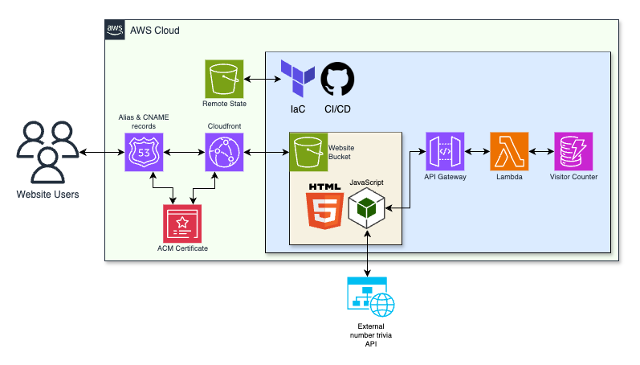
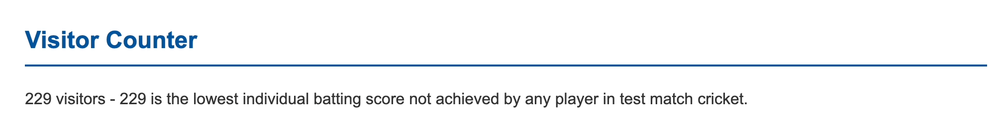

<a id="readme-top"></a>

<!-- PROJECT SHIELDS -->
<!--
*** I'm using markdown "reference style" links for readability.
*** Reference links are enclosed in brackets [ ] instead of parentheses ( ).
*** See the bottom of this document for the declaration of the reference variables
*** for contributors-url, forks-url, etc. This is an optional, concise syntax you may use.
*** https://www.markdownguide.org/basic-syntax/#reference-style-links
-->

[![Unlicense License][license-shield]][license-url]
[![LinkedIn][linkedin-shield]][linkedin-url]
![coverage-badge]


<!-- PROJECT LOGO -->
<br />
<div align="center">
    

  <h3 align="center">Cloud Engineered CV Website</h3>

  <p align="center">
    A static s3 website deployed using Infrastructure as Code and Continuous Integration and Deployment
    <br />
    <a href="https://andrewstride.com"><strong>Visit the website</strong></a>
    <br />
</div>


<!-- TABLE OF CONTENTS -->
<details>
  <summary>Table of Contents</summary>
  <ol>
    <li>
      <a href="#about-the-project">About The Project</a>
      <ul>
        <li><a href="#built-with">Built With</a></li>
      </ul>
    </li>
    <li>
      <a href="#getting-started">Getting Started</a>
      <ul>
        <li><a href="#prerequisites">Prerequisites</a></li>
        <li><a href="#installation">Installation</a></li>
      </ul>
    </li>
    <li><a href="#usage">Usage</a></li>
    <li><a href="#roadmap">Roadmap</a></li>
    <li><a href="#contributing">Contributing</a></li>
    <li><a href="#license">License</a></li>
    <li><a href="#contact">Contact</a></li>
    <li><a href="#acknowledgments">Acknowledgments</a></li>
  </ol>
</details>


<!-- ABOUT THE PROJECT -->
## About The Project

### Key Features
 <ul>
        <li>
          This project is a static s3 website managed using cloud infrastructure and methodologies
        </li>
        <li>
          AWS Infrastructure: Cloudfront, Route 53, S3, API Gateway, Lambda, DynamoDB
        </li>
        <li>
          Visitor Counter feature using AWS DynamoDB, Lambda and API Gateway
        </li>
        <li>
        Javascript to make API calls to Lambda (Python) and external API to fetch trivia
        </li>
        <li>Deployed using Infrastructure as Code through Terraform</li>
        <li>Automated test suite using Github Actions</li>
      </ul>

<p align="right">(<a href="#readme-top">back to top</a>)</p>

### Built With

 
 
 
 
 
 
 
 
 
 
 
 
 

### How it works

* User accesses "andrewstride.com" or "www.andrewstride.com"
* Route 53 Alias records direct to Cloudfront distribution
* Cloudfront, ACM and Route 53 redirect 'http' requests to 'https'
* The 'index.html' stored in s3 bucket is served to the user
* The Javascript file makes an API call to API Gateway, which invokes a Lambda to access the DynamoDB Visitor Counter table
* An external API call is made to gather trivia for the current visitor count

### Behind the scenes

* Updates to the website or infrastructure are pushed to Github repo branch
* Automated tests (in 'ci-cd.yaml' workflow) run that:
    * Format the code
    * Test the Javascript and Python
    * Plan any changes to infrastructure using Terraform
    * Terraform references remotely stored state file (s3)
* If changes approved, the branch is merged to main and the infrastructure is applied

<p align="right">(<a href="#readme-top">back to top</a>)</p>


<!-- GETTING STARTED -->
## Getting Started

To run this project you will need to:
* Have an AWS Account
* Have a website domain (these can be Route 53, Cloudfront and ACM or other providers)
* Install Terraform
* Fork this repo
* For local operation:
    * Create a 'terraform.tfvars' file in 'terraform' directory that declares 'website-bucket' and 'log-bucket' variables
* For remote operation:
    * Create Github Secrets with the following variable names:
        * 'WEBSITE_BUCKET'
        * 'LOG_BUCKET'
        * 'AWS_DEFAULT_REGION'
        * 'AWS_ROLE_ARN'
    * Create IAM Role giving your repo access to the necessary infrastructure

### Installation

* Clone the repo
   ```sh
   git clone https://github.com/andrewstride/website.git
   ```

To install the test suites locally:
* npm
  ```sh
  npm install npm@latest -g
  ```

* Install NPM packages
   ```sh
   npm install
   ```

* make
    ```sh
    make all
    ```

* Change git remote url to avoid accidental pushes to base project
   ```sh
   git remote set-url origin github_username/repo_name
   git remote -v # confirm the changes
   ```

<p align="right">(<a href="#readme-top">back to top</a>)</p>


<!-- USAGE EXAMPLES -->
## Screenshots



<p align="right">(<a href="#readme-top">back to top</a>)</p>


<!-- LICENSE -->
## License

Distributed under the Unlicense License.

<p align="right">(<a href="#readme-top">back to top</a>)</p>


<!-- CONTACT -->
## Contact

* LinkedIn: [https://www.linkedin.com/in/-andrew-stride-/](https://www.linkedin.com/in/-andrew-stride-/)
* Project Link: [https://github.com/andrewstride/website](https://github.com/andrewstride/website)

<p align="right">(<a href="#readme-top">back to top</a>)</p>


<!-- ACKNOWLEDGMENTS -->
## Acknowledgments


* [Cloud Resume Challenge](https://cloudresumechallenge.dev/docs/the-challenge/aws/)


<p align="right">(<a href="#readme-top">back to top</a>)</p>


<!-- MARKDOWN LINKS & IMAGES -->
<!-- https://www.markdownguide.org/basic-syntax/#reference-style-links -->
[contributors-shield]: https://img.shields.io/github/contributors/othneildrew/Best-README-Template.svg?style=for-the-badge
[contributors-url]: https://github.com/othneildrew/Best-README-Template/graphs/contributors
[forks-shield]: https://img.shields.io/github/forks/othneildrew/Best-README-Template.svg?style=for-the-badge
[forks-url]: https://github.com/othneildrew/Best-README-Template/network/members
[stars-shield]: https://img.shields.io/github/stars/othneildrew/Best-README-Template.svg?style=for-the-badge
[stars-url]: https://github.com/othneildrew/Best-README-Template/stargazers
[issues-shield]: https://img.shields.io/github/issues/othneildrew/Best-README-Template.svg?style=for-the-badge
[issues-url]: https://github.com/othneildrew/Best-README-Template/issues
[license-shield]: https://img.shields.io/github/license/othneildrew/Best-README-Template.svg?style=for-the-badge
[license-url]: https://github.com/othneildrew/Best-README-Template/blob/master/LICENSE.txt
[linkedin-shield]: https://img.shields.io/badge/-LinkedIn-black.svg?style=for-the-badge&logo=linkedin&colorB=555
[linkedin-url]: https://linkedin.com/in/-andrew-stride-
[coverage-badge]: https://img.shields.io/badge/coverage-100%25-green

